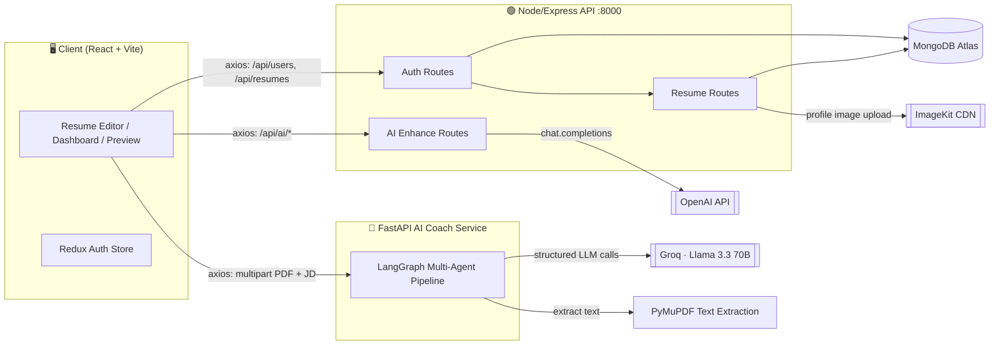
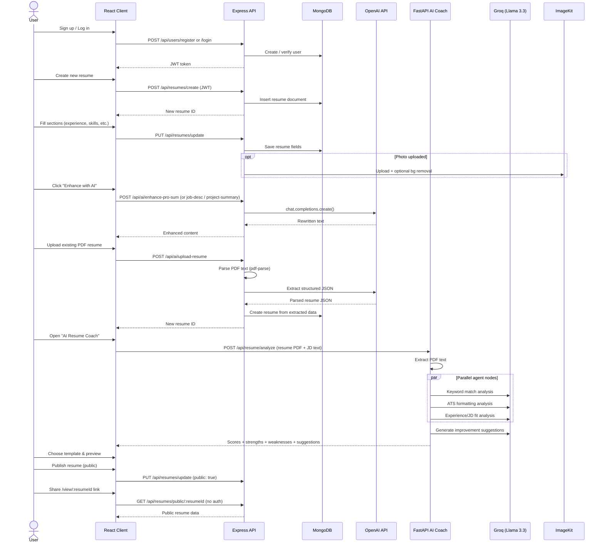

# 📄 Resume Builder

A full‑stack, AI‑powered resume builder that lets you create, customize, and export ATS‑friendly resumes — plus get an AI "coach" review of how well your resume matches a job description.

The project is split into **three independent services** that work together:

| Service | Tech | Responsibility |
|---|---|---|
| `client/` | React 19 + Vite + Redux Toolkit + Tailwind CSS 4 | UI, resume editor, live preview, template gallery |
| `server/` | Node.js + Express 5 + MongoDB (Mongoose) | Auth, resume CRUD, image upload, GPT‑powered content enhancement, PDF parsing |
| `aibackend/` | Python + FastAPI + LangGraph + Groq (Llama 3.3) | Multi‑agent ATS/JD match analysis ("AI Resume Coach") |

---

## ✨ Features

- **Drag‑free, form‑based resume editor** — personal info, professional summary, experience, education, projects, and skills, all synced to a live preview pane
- **10 professional templates** (Classic, Modern, Minimal, Timeline, Technical, Elegant, Compact, Bold Header, Professional Sidebar, Minimal + Image) — swap templates without losing data
- **AI content enhancement** — one‑click GPT rewriting of your professional summary, job descriptions, and project summaries into concise, ATS‑friendly copy
- **Resume import** — upload an existing PDF resume and have GPT extract structured data (contact info, experience, education, skills) straight into a new resume
- **AI Resume Coach** — upload a resume + paste a job description and get back a keyword‑match score, ATS score, experience score, matched/missing skills, strengths/weaknesses, and concrete improvement suggestions, powered by a LangGraph multi‑agent pipeline
- **Profile photo upload** with optional background removal (ImageKit)
- **Public share links** — publish a resume and share a read‑only public view
- **JWT authentication** — secure register/login, protected resume routes
- **Multi‑resume dashboard** — create, rename, duplicate‑style manage, and delete multiple resumes per account

---

## 🏗️ Architecture



**Why two backends?** The Node/Express server owns the core product — accounts, resumes, and small GPT rewrite calls. The Python FastAPI service is a dedicated, independently‑deployed micro‑service that runs a **LangGraph** agent graph for the heavier resume‑vs‑job‑description analysis, using Groq's hosted Llama 3.3 model. The client talks to both.

---

## 🔄 End‑to‑End Flow



---

## 📁 Project Structure

```
Resume_Builder/
├── client/                      # React frontend (Vite)
│   └── src/
│       ├── app/
│       │   ├── store.js         # Redux store
│       │   └── features/authSlice.js
│       ├── components/
│       │   ├── templates/       # 10 resume templates
│       │   ├── home/             # Landing page sections
│       │   ├── PersonalInfoForm.jsx, ExperienceForm.jsx, EducationForm.jsx,
│       │   ├── ProjectForm.jsx, SkillsForm.jsx, ProfessionalSummaryForm.jsx
│       │   ├── ColorPicker.jsx, TemplateSelector.jsx, AIEnhanceButton.jsx
│       │   └── ResumePreview.jsx, Navbar.jsx, Loader.jsx
│       ├── configs/
│       │   ├── api.js           # Axios instance → Express server
│       │   └── aiApi.js         # Axios instance → FastAPI AI Coach
│       └── pages/
│           ├── Home.jsx, Login.jsx, Dashboard.jsx
│           ├── ResumeBuilder.jsx, chooseTemplate.jsx, Preview.jsx
│           └── AIResumeCoach.jsx
│
├── server/                      # Express backend
│   ├── configs/                 # db.js, ai.js (OpenAI), imageKit.js, multer.js
│   ├── controllers/             # userController, resumeController, aiController
│   ├── middlewares/authMiddleware.js
│   ├── models/                  # User.js, Resume.js (Mongoose schemas)
│   ├── routes/                  # userRoutes, resumeRoutes, aiRoutes
│   └── server.js
│
└── aibackend/                   # FastAPI AI Resume Coach microservice
    └── app/
        ├── main.py               # FastAPI app entrypoint
        ├── routes/resume.py      # POST /api/resume/analyze
        └── services/
            ├── pdf_services.py    # PDF text extraction
            └── ai_services.py     # LangGraph multi-agent scoring pipeline
```

---

## 🛠️ Tech Stack

**Frontend**
- React 19, React Router 7, Redux Toolkit
- Tailwind CSS 4
- Axios, react-hot-toast, lucide-react icons
- Vite

**Backend (core API)**
- Node.js, Express 5
- MongoDB + Mongoose
- JWT (`jsonwebtoken`) + `bcrypt` for auth
- OpenAI SDK (professional summary / job description / project summary rewriting, resume PDF → JSON extraction)
- `pdf-parse` for PDF text extraction
- `multer` for file uploads, `@imagekit/nodejs` for image hosting + background removal

**AI Coach Microservice**
- Python, FastAPI, Uvicorn
- LangGraph + LangChain for the multi‑agent orchestration
- Groq (`llama-3.3-70b-versatile`) as the LLM
- PyMuPDF for PDF parsing
- Pydantic for structured LLM outputs

---

## 🚀 Getting Started

### Prerequisites
- Node.js 18+
- Python 3.11+
- A MongoDB connection string (e.g. MongoDB Atlas)
- API keys: OpenAI, Groq, ImageKit

### 1. Clone the repo
```bash
git clone https://github.com/singh-29-naina/Resume_Builder.git
cd Resume_Builder
```

### 2. Backend — Express API (`server/`)
```bash
cd server
npm install
```
Create `server/.env`:
```env
PORT=8000
MONGODB_URI=your_mongodb_connection_string
JWT_SECRET=your_jwt_secret
OPENAI_API_KEY=your_openai_api_key
OPENAI_MODEL=gpt-4o-mini
IMAGEKIT_PUBLIC_KEY=your_imagekit_public_key
IMAGEKIT_PRIVATE_KEY=your_imagekit_private_key
IMAGEKIT_URL_ENDPOINT=your_imagekit_url_endpoint
```
```bash
npm run server   # nodemon, or `npm start` for production
```

### 3. AI Resume Coach — FastAPI (`aibackend/`)
```bash
cd aibackend
python -m venv venv
source venv/bin/activate       # Windows: venv\Scripts\activate
pip install -r requirements.txt
```
Create `aibackend/.env`:
```env
GROQ_API_KEY=your_groq_api_key
```
```bash
uvicorn app.main:app --reload --port 8000
```
> ⚠️ Note: the Express API and this FastAPI service both default to port `8000`. Run them on different ports (e.g. `--port 8001` for FastAPI) and update the client's AI Coach base URL accordingly.

### 4. Frontend (`client/`)
```bash
cd client
npm install
```
Create `client/.env`:
```env
VITE_BASE_URL=http://localhost:8000
```
Also update `client/src/configs/aiApi.js` to point at your local FastAPI instance during development (it currently points to a deployed Render URL).
```bash
npm run dev
```
Visit **http://localhost:5173**.

---

## 📡 Core API Endpoints

**Express API** (`server/`)

| Method | Endpoint | Auth | Description |
|---|---|---|---|
| POST | `/api/users/register` | – | Create an account |
| POST | `/api/users/login` | – | Log in, get JWT |
| GET | `/api/users/data` | ✅ | Get current user |
| GET | `/api/users/resumes` | ✅ | List current user's resumes |
| POST | `/api/resumes/create` | ✅ | Create a blank resume |
| GET | `/api/resumes/all` | ✅ | List all resumes |
| GET | `/api/resumes/get/:resumeId` | ✅ | Get a single resume |
| PUT | `/api/resumes/update` | ✅ | Update resume fields / photo |
| DELETE | `/api/resumes/delete/:resumeId` | ✅ | Delete a resume |
| GET | `/api/resumes/public/:resumeId` | – | Public read‑only resume view |
| POST | `/api/ai/enhance-pro-sum` | ✅ | AI‑rewrite professional summary |
| POST | `/api/ai/enhance-job-desc` | ✅ | AI‑rewrite a job description |
| POST | `/api/ai/project-summary` | ✅ | AI‑rewrite a project summary |
| POST | `/api/ai/upload-resume` | ✅ | Parse PDF resume → new structured resume |

**FastAPI AI Coach** (`aibackend/`)

| Method | Endpoint | Description |
|---|---|---|
| GET | `/` | Health check |
| POST | `/api/resume/analyze` | Upload resume PDF + job description → keyword/ATS/experience scores + suggestions |

---

## 🗺️ Roadmap Ideas
- Merge the AI Coach service into the main API (or containerize both behind one gateway)
- Add resume version history / revert
- LinkedIn profile import
- Cover letter generator using the same AI pipeline

---

